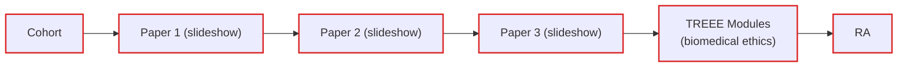
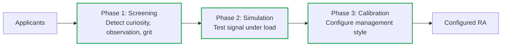
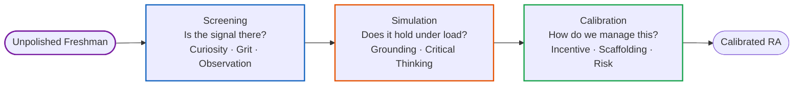

*Late 2024 – Ongoing*

Status: PI accepted the redesign. Doing one more pass to develop the post-recruitment layer. What happens after recruitment is the harder problem.

## Why

- DIAL's legacy recruitment system is a funnel:
  - Cohort taken per semester
  - Assigned three HCI papers from the lab, they have to synthesise then present the papers (slideshow)
  - Finish three ethics modules from TREE (what an IRB is, working with human subjects, do no harm)

*Figure 1: Legacy Recruitment Pipeline*

- I had to go through the same screening process. I made all three presentations so I could start working immediately. Halfway through the second presentation the lab staff stopped me and said I don't have to do the rest. He said that my slide designs were "sober" and my English was good
  - It felt weird to get complimented on those criteria when I expected more depth on the research. I won the screening here because I'm heavily bilingual and think in both languages so presenting a paper and speaking in English wasn't a problem for me. However I believe that shouldn't be the criteria that I should win on.

- DIAL's recruitment pipeline completely contradicted their values of inclusivity as it's based on an NCTB-inspired rote memorisation pedagogical approach. Hinders from developing talent.

- NSU's incoming freshman class has a sizable majority that is unfamiliar with making slides let alone presenting them. Testing them on an ability they haven't been taught yet is unfair. Testing them on reading comprehension when they don't know how to read an academic article in the first place is also very unfair. This leads to memorisation, AI plagiarism and reading text off the slides.

- **If we are to be inclusionary, we must look for reasons to admit applicants who might not be polished, but have potential. We needed a system that could detect raw signal amidst the noise of an unpolished freshman.**

- I went through so many versions of this while designing it because I realised **my design would fail in NSU's context because my frame of reference was wrong**. Originally, I felt unfairly advantaged so I redesigned it to have two phases. That was in May 2025. This time around I felt like there needed to be more guardrails and notes for each question (what signal I'm trying to extrapolate, observations & actionable suggestions). I ended up building out all of it to realise I hadn't considered my positionality.
    - The world I'm in is AP & IB & IAL -> Ivy League/YCombinator. Everyone's hypercompetent, collaborative and hungry to do more and do it better. I was filtering for top talent when I needed to filter for unpolished potential.
    - I started again from scratch, made a signal dictionary of what I want to measure. The questions are a frontend for the signals (grit, resilience, creativity, etc) and the questions can be changed. The underlying structure is the signals are then split into phases: pre-screening, secondary screening, onboarding, recurring 1:1s.

## What

A complete overhaul of DIAL's recruitment pipeline to adapt for the agentic era and test students on their curiosity and grit and qualities that are hard to fake. Designed for applicants with constraint-laden backgrounds in mind.

*Figure 2: Redesigned Recruitment Pipeline*

- **Redesigned System:** A progressive resolution system split into three phases:
    1. **Screening:** A diagnostic questionnaire testing for values-fit, curiosity, and observation skills rather than academic jargon.
    2. **Simulation:** They still present a paper with slides as the format, as that's what the lab is used to, but we're no longer evaluating whether they understood the mechanics of the paper. The question is whether they can connect what the paper argues to something they've personally observed or experienced. A student who grounds a finding in their own neighbourhood is showing more than one who recites the methodology.
    3. **Calibration:** A standardised onboarding protocol that configures the management style (incentives, scaffolding, risk) based on the student's specific profile.

*Figure 3: Theory of Change - Progressive Resolution System*

- **The Signal Dictionary (Backend):** Capturing "messy" variables like curiosity by grounding them in high-fidelity observations (e.g., identifying friction in the design of daily objects).
  - This is an informal vibes-based codebook trying to codify observable behaviour. This redesign comes from my experience leading teams and observations while at DIAL, there's no dataset I can pull to validate what makes a good research assistant but I can rely on inter-rater reliability as a blunt heuristic.
  - The logic maps onto the same problem where if different reviewers are assessing curiosity independently then you have to define what curiosity actually looks like in the room.

- **Hard-coded Empathy:** The standardised rubric embeds inclusive values directly into the review process so that correct behaviour doesn't depend on any individual's judgment call. Bolted on inter-rater reliability.
- Replaced TREEE (a biomedical ethics module) with Macquarie University's social science ethics course and the Center for Humane Technology's course as the old training was contextually irrelevant to HCI fieldwork.

**This system only works because of the qualitative component to DIAL's research.**

My view is that this is a systems design problem. The PI wants and practices inclusive recruitment, but that value isn't encoded into the structure - it ends up being a preference without an enforcement mechanism. I redesigned to apply software patterns to fix that: define the signals, build sensors, configure outputs.

DIAL often works for low-resource contexts, this reframes it from "charity work" to a practical engineering constraint that's applicable everywhere. This redesign treats the lab as a complex social system where technical abstractions are used to model and preserve human empathy against systemic entropy.

## Additional Info

- As of today, with the old process, you can throw the entire paper's pdf into Claude for PowerPoint and have it output a well-designed slide that you can just read off of. The entire playing field has changed.

- I wrote these questions to gauge how much they actually engage with the research and relate to their own personal experiences. Even if they use ChatGPT to answer them, they will have still learned something in the process and that's still a win.

- There might be a lot of kids at NSU that don't really care about problems in Bangladesh. They're surviving through here and their goal is to go abroad for a masters. They might think that working for low resource contexts might be beneath them because they're trying to solve a local problem. They're the harbingers of funding so they'll work on high resource problems instead.
    - They need to understand that in the context of software, efficiency is not a bad thing. When vertical scaling is free then the apps are ram-hungry slop machines. When forced into resource constraints they are forced to improve and lower long term costs too.
