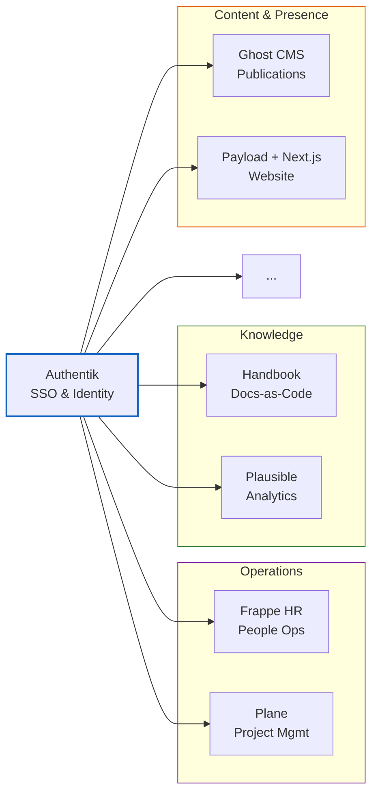

*2025 – Ongoing*

## What

- An opinionated and reproducible tech stack for nonprofits and student organisations designed with lean, remote-first and async-by-default practices in mind. Includes a template for an organisational handbook and to make everything LLM-ingestable by default. The core of it is designed to run on low-cost infra with minimal maintenance.
  - Newer organisations do not carry legacy practices or have multiple people to train. This lays concrete foundations they can build on top of, keeping in mind that everything will be legible to an agentic intelligence layer.

- In my experience I've seen a few patterns emerge organically
  - Student organisations start out with smaller teams, they move fast, they ignore some standard practices like maintaining documentation, doing project management or maintaining communication. This is only possible in teams that are small and in-person. The bad practices balloon into organisational debt that cannot be handled when scaled up.
  - The debt does take a toll when onboarding is oral tradition and all information exists in people's heads or in lost messages and emails.

- Technical note: this is *not* building software from scratch, the project is all containerised applications arranged in an opinionated way. It is far more feasible to maintain the glue that holds it together than building the software from scratch up.

- **Examples**
  - [Frappe HR](https://frappe.io/hr) is an excellent opensource answer to expensive and heavy HR systems.
  - [Plane](http://plane.so/) took inspiration from [Linear](https://linear.app/) and has the same underlying mental models that led to Linear's success except they adapted it to be more flexible.
    - Usually project management tools target enterprise software teams, are too complicated, opinionated and expensive.
  - [Plausible](https://plausible.io/) is a very lightweight and privacy focused Google Analytics alternative.
  - Using [Authentik](https://goauthentik.io/) for a unified dashboard experience

**Figure 1:** The Fieldkit stack. Authentik provides a unified SSO layer across all services, grouped by function.

## Why

- Giving people the tools without an underlying structure will likely end up in abandonment. A core part of Fieldkit is the standard organisation handbook that should be maintained as operational docs for teams involved. It's minimal by design and is meant to be adapted by each organisation.
  - At a mid-sized organisation, SOPs are infrastructure. You cannot scale software without scaling culture. I treat the organisation's handbook as **"wetware infrastructure"** - like code that runs on humans and agents. Fieldkit deploys both the software (Docker containers) and the culture (Markdown Handbooks) in a single "install" that organisations can then adapt to their needs.
  - I've observed that the conditions for deploying effective AI agents (high traceability, zero data silos, rigorous documentation) are identical to the conditions for a healthy, remote-first workplace. Fieldkit enables this organisational health, but the system will degrade if the human culture does not maintain these standards.

- We enforce a "Standard Configuration" because maintaining the "glue" for every possible software combination is technically impossible for us and cognitively exhausting for the user. We take on the decision debt so they don't have to.

- There is a market failure for mid-sized impact organisations. They are served either by free consumer tools (which don't scale) or enterprise SaaS (which they can't afford). There are some great open-source tools that solve those individual problems
  - This is similar to opinionated Linux distros like Omarchy. Similar to how senior dev scaffold projects.
  - I'm trying to lower the cognitive tax of creating an organisation and hitting the ground running.
  - Most of these organisations will not scale beyond 30-50 people, especially if it's a high-churn environment like student organisations or research labs. If it's a company, this setup still avoids vendor lock-in because scaling up means vertically scaling to a bigger VPS (still a marginal cost increase) or migrating data to other tools which they all support.

## Additional Info

<Callout type="info" title="AWS Activate Credits">
Received **$5k in AWS Activate Credits** via DAY/Hack+ and had initial conversations with AWS Solutions Architects (Nov 2025) about the architecture.
</Callout>

- DAY is the active proving ground. Each DAY project is a Fieldkit module being validated in a real org:
  - **Ghost CMS** literature workflow (live)
  - **Frappe HR** self-hosted HR system (live)
  - **GitLab-style handbook** Astro + Starlight, docs-as-code (live)
  - **Design system + user journey mapping** shadcn/ui + Tailwind (live)
  - **Next.js + Payload CMS** site rebuild (in progress)

- Currently mid-restructuring at DAY with a consultant. The outcome of this overhaul becomes the Fieldkit template. The goal is to extract a reproducible, opinionated stack from a real deployment rather than designing for a hypothetical org.

- If the DAY model holds, Hack+ is a natural distribution channel. They already provision new orgs with technical infrastructure via vendor partnerships, but most orgs lack the expertise to use it. Fieldkit bridges that gap as an open-source project.
