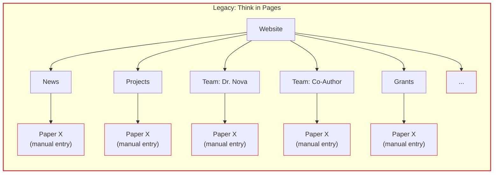
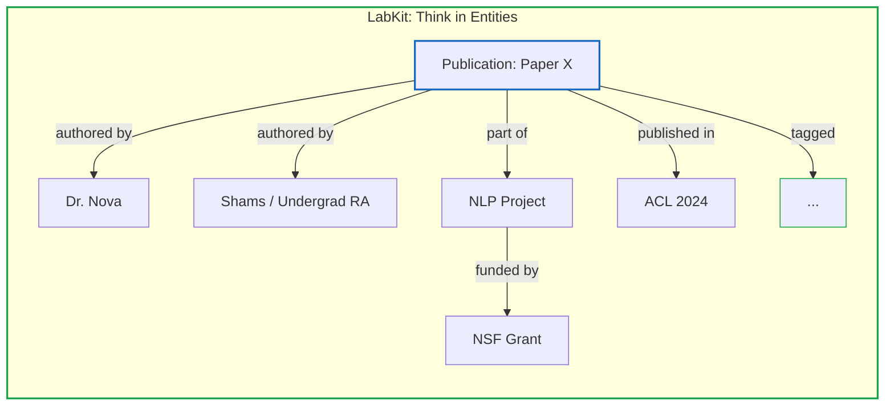

*Late 2024 – Ongoing*

## What

- I was asked to do a standard website refresh for DIAL when I realized that a "website" would fail because manual maintenance exacts a high cognitive tax in academia. Instead, I built LabKit, a Research Knowledge Orchestration Platform (RKOP).

- Standard tools like Wix/WordPress treat research labs like a static brochure for marketing agencies and force a rigid tree structure (page -> subpage). To add a paper, the user needs to manually update the News page, the Project page, each co-author's individual profile, the Grants page, the Research Themes section and every other page that carries any relationship to that data. A single publication with two co-authors already requires five or more separate manual edits. This high maintenance tax causes content rot and students end up invisible. This is also a core ontological mismatch between the researcher's native mental model of academia, and what structure the site-builder forces them to think in.

**Figure 1:** In the legacy page tree, the same paper must be entered multiple times as disconnected manual entries - once under News, once under Projects, once under each author's profile and then more.

**Figure 2:** In LabKit, the same paper is a single node with declared relationships. File it once; the graph propagates it everywhere.

- The redesigned system has an underlying semantic graph that has a single source of truth architecture. Researchers don't manage "pages", they input data into a "filing cabinet" (e.g., "File a Grant"). The system acts as a semantic graph that automatically propagates that connection to update the Project timeline, the Student's portfolio, and other relevant areas. The website is simply the automated frontend for this database. Filing a grant still involves declaring its relationships in which project it funds, which team members are on it but all of that happens in one context with no page-switching.

## Why

- Academic content is not marketing copy. A publication is a scholarly object with strict metadata (DOI, Venue, Citations), not a blog post. Generic CMS tools break data integrity and weren't designed for academic contexts. Academic sites are often ugly but get the job done. It doesn't have to be that way.
- At the current phase, this platform delivers a website. At its core, the website is just one expression of the data. By having all of the lab's data in one centralised and structured place, I am building the foundations for future agentic infrastructure.
- I looked for a research lab CMS and it didn't exist. The paid website templates that existed (found only one for a lab) were incredibly ugly and didn't have half of what I needed. The rest were custom commissioned (think MIT Media Lab site).
- Getting your first publication authorship on a real published paper as an undergraduate RA is difficult. In reality, RAs work on multiple projects that produce papers, and even if they don't get authorship, they get credit mentioned in the paper. The profile page for the RA in the site gives them auto-distributed credit by design rather than having to waft through papers individually.

## Additional Info

- **Stack:** Built on PayloadCMS 3 (headless CMS), Next.js, and MongoDB. UI components from shadcn/ui, which sets a visual standard that matches the quality of the research being produced rather than defaulting to the academic web's typical ugliness.
- **Scholarly data compliance:** The site outputs JSON-LD metadata compliant with Google Scholar's indexing spec and OpenAlex's schema. DIAL's publications surface in actual academic search infrastructure instead of just Google and are readable by the AI tools that increasingly mediate how researchers discover work. I believe this will directly impact citation count and collaboration request rates for DIAL.
- **Agentic SEO:** Beyond scholarly compliance, the frontend meets current agent-readability standards like server-rendered HTML with no JavaScript rendering barrier, semantic markup, clean sitemaps, and correctly configured robots.txt for AI crawlers. AI tools (GPTBot, Claude, Perplexity) can fully index the site without any additional configuration, meaning DIAL's research surfaces in AI-mediated discovery by default.
- **Future direction:** The knowledge base is designed to be queryable beyond a webpage. Planned builds include a CLI and agent integration layer so AI tools can query the lab's full research graph (publications, grants, projects, team, etc) directly, without going through a page.
