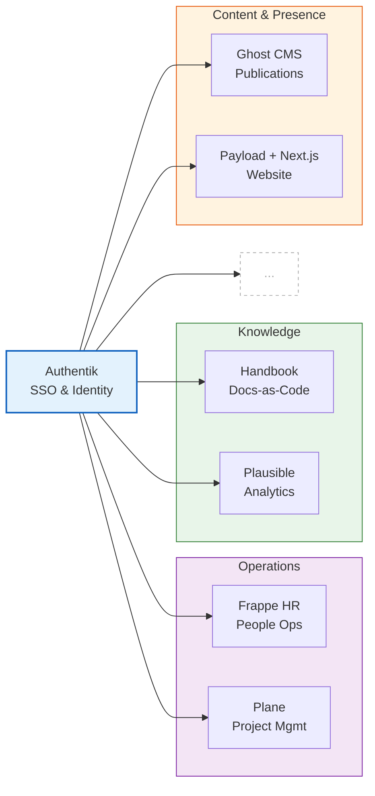

## Breezer's Brew (School Student Lit Org)

*2022 – 2023*

### What

- South Breeze School's first literary organisation with 50+ members
- Mentored writers, editors and artists to create a complete indie mag
  - Published + distributed to bookstores + ISBN registration
  - Available as a PDF online
- Took inspiration from DAY's literature department on how to run it, effectively ran the same model with tweaks for the Bangladeshi context
- Learned InDesign and editorial design
- Raised BDT 140k+ (~ $1150) by selling letterman jackets — a response to the magazine not raising enough to break even
  - They loved it so much the jackets became part of the school uniform. They want it every year now

### Why

- I wanted a platform to showcase literary talent and for writers to hone their craft
- Didn't have a single platform available so I built my own.

### Additional Info

- The breezersbrew.org website is currently down, it has the full pdf + more publications
- Honestly 2023 feels so long ago I forgot what I was doing but this took me over a year of prep and fundraising

---

## Literature Organisation Workflow Redesign with Ghost CMS

*2024*

### What

- DAY Literature is the largest department construed of smaller teams with lead editors and writers, a separate publishing team works on getting things live. The workflow is complex and lives inside a multi-tab Google spreadsheet that serves as team management, reference library and project tracking.

- The previous workflow had a big human error surface area due to gruntwork repetition. Applied software DRY principles to migrate to a simpler open-source Ghost CMS & Google Docs architecture.
  - Redesigned the architecture to treat Editors as first-class citizens, providing them with dashboards, credit, and better tools.

- The legacy workflow (Google Sheets) treated articles as static files hidden in tabs. The new workflow (Ghost Dashboard) treats articles as state objects (Pitch -> Review -> Published). This shift from file management to state management reduces the cognitive load on the team, as the status of every piece of content is visible at a glance.

- To solve the invisible editor problem, I utilised Ghost's tag system (e.g., tagging a post `Edited by: Chloe Dong`). This forces the CMS to auto-generate a public portfolio page for every editor so they have a shareable record of their contributions.
  - Credit allocation is structurally enforced by design instead of being left as an afterthought.

- Decoupled the act of writing (Google Docs or whatever the writer wants) from the act of publishing (Ghost). This allows writers to work in a familiar environment without wrestling with a CMS, while editors control the final rendered state.

### Why

- The previous workflow only made sense if you were in the team for a long while. Simplifying it was proper engineering in my opinion because then it's less prone to breaking. Maintenance tax is real sadly and the previous one already had lapses in records.
- Editors got credit at the end of the article, with their names written in different formats sometimes. The data design had no space for editors as first-class entities next to writers.
- Moving to Ghost (Open Source) aligns our infrastructure with our values of transparency and ensures we own our data rather than renting it from a closed garden like Wix.

### Additional Info

- Used webhooks to listen for tag changes. When an article is tagged `#editorial-review`, the system automatically creates a Google Doc from the pitch, links it back to Ghost, and alerts the editing team on Discord. This removes the manual friction of setting up documents.
- Visibility is the currency of contribution. Using the tagging system to generate editor portfolios was my way of re-engineering the symbolic economy of the team.

---

## DAY Design System & Marketing Funnel

*2024 – Ongoing*

### What

- Led a UI/UX team to audit DAY's design history, then create a new visual direction that reflected how DAY grew as an organisation. Developed a design system based on `shadcn/ui` and Tailwind CSS to standardise the visual language.
- Collaborated with Marketing and senior partners to create a user journey map that models the lifecycle of the different archetypes/personas of people that interact with DAY to their ultimate goals so we could identify pain points at each stage and mitigate them.

### Why

- Brand consistency was impossible to enforce manually due to the sheer size of DAY. We needed a component-based system where "correct" design is the default state, ensuring a professional appearance regardless of who is building the page.
- The organization lacked a clear understanding of why engagement was low. Mapping the customer journey allowed us to treat recruitment and engagement as a systematic funnel to identify specific friction points in the user experience. Currently being completely overhauled.

---

## GitLab-Inspired Handbook

*2024 – Ongoing*

### What

- DAY is completely remote and async by default. This type of organisation won twice, once during COVID, again during the agentic era. **This means the entire organisation needs to be legible to both remote workers and AI.**

- A public, open-source, version-controlled handbook (built with Astro + Starlight) that serves as the single source of truth (SSoT) for the entire organisation.

- An org handbook exists to answer the question of how and why something is done. It is the company knowledge distilled onto written form. This is an intentional practice that is incredibly annoying to do at first but pays compounding dividends the longer you do it. Sections have DRIs (directly responsible individuals) and anybody can contribute.
  - This is documentation as code. Changes are submitted as pull requests reviewed by code owners, and versioned in Git.

- A shift from information siloed in heads or DMs to explicit knowledge (live at `handbook.dearasianyouth.org`)

### Why

- DAY has 300+ remote volunteers, information needs to flow fast and free to the person that needs it. This is both async and scaleable.
- **If it's not written down, it doesn't exist**
  - We adopted GitLab's philosophy to have a handbook that ensures that every member operates on the same shared reality.

- Given the structure, this forces the person to contextualise their change in the larger scheme of how the organisation works. They have to locate the section where their change would be, and see what else gets affected. This is something AI is still notoriously bad at.
  - Anyone in the organisation, or even outside it, can submit a change. This is to **decentralise governance** and take a flatter and more community oriented approach. The DRI only needs to see the change, and then accept/deny it.
  - The pull request workflow is intentional friction that functions as a consensus algorithm. It forces ambiguity to be resolved *before* a policy is merged. Unlike a Google Doc where edits are fluid and often ignored, a Git-based workflow requires explicit approval from stakeholders and creates a rigorous audit trail of decision-making.

- Institutional Memory as distributed ledger
  - We tried to reframe management as an information retrieval problem. High-turnover organisations suffer from knowledge decay. The handbook acts as externalized long-term memory that preserves the "state" of the organisation independent of the specific humans currently staffing it. It transforms the org from a volatile to a persistent system.

### Additional Info

- **Restructuring & Fieldkit Integration:** As of April 2026, DAY is undergoing a massive organisational restructuring. This handbook is the live production environment for this change. We are actively rewriting all SOPs that hold the new structure together, directly applying the wetware code philosophy from [Fieldkit OSS](#fieldkit-oss).
- **Architecture:** Directories map to departments and `.codeowners` files assign maintenance responsibility to specific leads, ensuring documentation never goes stale.

#### Direct Excerpt from GitLab's Handbook

[handbook.gitlab.com/handbook/about](https://handbook.gitlab.com/handbook/about/)

At GitLab our handbook is extensive and keeping it relevant is an important part of everyone's job. It is a vital part of who we are and how we communicate. We established these processes because we saw these benefits:

1. Reading is much faster than listening.
2. Reading is async, you don't have to interrupt someone or wait for them to become available.
3. Talent Acquisition is easier if people can see what we stand for and how we operate.
4. Retention is better if people know what they are getting into before they join.
5. On-boarding is easier if you can find all relevant information spelled out.
6. Teamwork is easier if you can read how other parts of the company work.
7. Discussing changes is easier if you can read what the current process is.
8. Communicating change is easier if you can just point to the diff.
9. Everyone can contribute to it by proposing a change via a merge request.

One common concern newcomers to the handbook express is that the strict documentation makes the company more rigid. In fact, writing down our current process in the handbook has the effect of empowering contributors to propose change. As a result, this handbook is far from rigid. You only need to look at the [handbook commits list](https://gitlab.com/gitlab-com/content-sites/handbook/-/commits/main) to see the evidence. Every attempt is made to document guidelines and processes in the handbook. However, it is not possible to document every possible situation or scenario that could potentially occur. Just because something is not yet in the handbook does not mean that it is allowed. GitLab will review each team member's concern or situation based on local laws to determine the best outcome and then update the handbook accordingly. If you have questions, please discuss with your manager or contact the [People Success](https://handbook.gitlab.com/handbook/people-group/) team.

---

## Fieldkit OSS

*2025 – Ongoing*

### What

- An opinionated and reproducible tech stack for nonprofits and student organisations designed with lean, remote-first and async-by-default practices in mind. Includes a template for an organisational handbook and to make everything LLM-ingestable by default. The core of it is designed to run on low-cost infra with minimal maintenance.
  - Newer organisations do not carry legacy practices or have multiple people to train. This lays concrete foundations they can build on top of, keeping in mind that everything will be legible to an agentic intelligence layer.

- In my experience I've seen a few patterns emerge organically
  - Student organisations start out with smaller teams, they move fast, they ignore some standard practices like maintaining documentation, doing project management or maintaining communication. This is only possible in teams that are small and in-person. The bad practices balloon into organisational debt that cannot be handled when scaled up.
  - The debt does take a toll when onboarding is oral tradition and all information exists in people's heads or in lost messages and emails.

- Technical note: this is *not* building software from scratch, the project is all containerised applications arranged in an opinionated way. It is far more feasible to maintain the glue that holds it together than building the software from scratch up.

- **Examples**
  - [Frappe HR](https://frappe.io/hr) is an excellent opensource answer to expensive and heavy HR systems.
  - [Plane](http://plane.so/) took inspiration from [Linear](https://linear.app/) and has the same underlying mental models that led to Linear's success except they adapted it to be more flexible.
    - Usually project management tools target enterprise software teams, are too complicated, opinionated and expensive.
  - [Plausible](https://plausible.io/) is a very lightweight and privacy focused Google Analytics alternative.
  - Using [Authentik](https://goauthentik.io/) for a unified dashboard experience

**Figure 1:** The Fieldkit stack. Authentik provides a unified SSO layer across all services, grouped by function.

### Why

- Giving people the tools without an underlying structure will likely end up in abandonment. A core part of Fieldkit is the standard organisation handbook that should be maintained as operational docs for teams involved. It's minimal by design and is meant to be adapted by each organisation.
  - At a mid-sized organisation, SOPs are infrastructure. You cannot scale software without scaling culture. I treat the organisation's handbook as **"wetware infrastructure"** — like code that runs on humans and agents. Fieldkit deploys both the software (Docker containers) and the culture (Markdown Handbooks) in a single "install" that organisations can then adapt to their needs.
  - I've observed that the conditions for deploying effective AI agents (high traceability, zero data silos, rigorous documentation) are identical to the conditions for a healthy, remote-first workplace. Fieldkit enables this organisational health, but the system will degrade if the human culture does not maintain these standards.

- We enforce a "Standard Configuration" because maintaining the "glue" for every possible software combination is technically impossible for us and cognitively exhausting for the user. We take on the decision debt so they don't have to.

- There is a market failure for mid-sized impact organisations. They are served either by free consumer tools (which don't scale) or enterprise SaaS (which they can't afford). There are some great open-source tools that solve those individual problems
  - This is similar to opinionated Linux distros like Omarchy. Similar to how senior dev scaffold projects.
  - I'm trying to lower the cognitive tax of creating an organisation and hitting the ground running.
  - Most of these organisations will not scale beyond 30-50 people, especially if it's a high-churn environment like student organisations or research labs. If it's a company, this setup still avoids vendor lock-in because scaling up means vertically scaling to a bigger VPS (still a marginal cost increase) or migrating data to other tools which they all support.

### Additional Info

- Received **$5k in AWS Activate Credits** via DAY/Hack+ and had initial conversations with AWS Solutions Architects (Nov 2025) about the architecture.

- DAY is the active proving ground. Each DAY project is a Fieldkit module being validated in a real org:
  - **Ghost CMS** literature workflow (live)
  - **Frappe HR** self-hosted HR system (live)
  - **GitLab-style handbook** Astro + Starlight, docs-as-code (live)
  - **Design system + user journey mapping** shadcn/ui + Tailwind (live)
  - **Next.js + Payload CMS** site rebuild (in progress)

- Currently mid-restructuring at DAY with a consultant. The outcome of this overhaul becomes the Fieldkit template. The goal is to extract a reproducible, opinionated stack from a real deployment rather than designing for a hypothetical org.

- If the DAY model holds, Hack+ is a natural distribution channel. They already provision new orgs with technical infrastructure via vendor partnerships, but most orgs lack the expertise to use it. Fieldkit bridges that gap as an open-source project.
