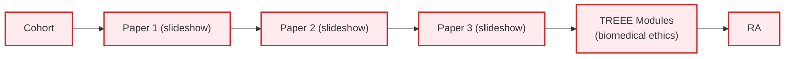
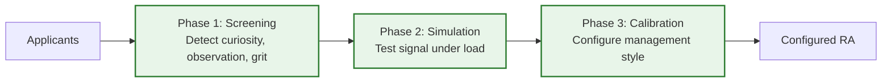
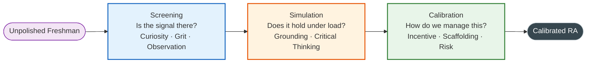
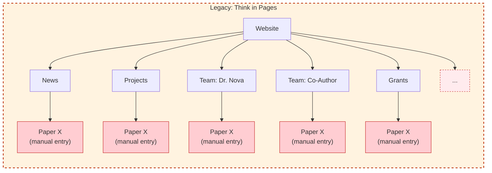
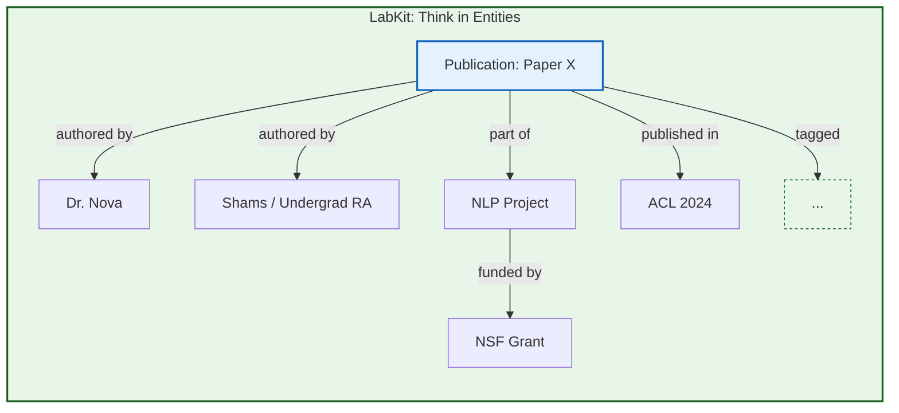

<Callout type="info" title="My role at DIAL">
All projects below were built as a Research Assistant at [DIAL, North South University](https://dial.northsouth.edu) under Dr. Nova Ahmed - an HCI lab focused on inclusive and low-resource contexts.

Full role description in [Reference](/docs/reference#experience).
</Callout>

## Nonbinary NLP Research Proposal (MISGENDERED++)

*2024 - Archived*

<Callout type="warn" title="Archived">
Archived after *Ovalle et al. (2024)* argued that neo-pronouns were being incorrectly spliced at the tokeniser level - fixing that essentially solved the underlying engineering problem this proposal was diagnosing. A diagnostic benchmark became a solution in search of a problem.
</Callout>

### What

- An architectural plan for a robustness evaluation framework designed to address gaps in the *MISGENDERED* (Hossain et al., 2023) benchmark.
  - The paper tried to evaluate gender bias in LLMs by benchmarking how well it handled nonbinary pronoun usage. They used masked language modeling which was like a template based approach. It would feed in a sentence and ask the model to complete it (fill in the blanks)
  - While *MISGENDERED* relied on explicit declaration templates ("Jamie uses xe/xem"), my proposal introduced implicit contextual usage ("Jamie is preparing xyr report") and adversarial testing (injecting noise, distractors, and code-switching) to model real-world usage.

- **Produced a paper proposal with citations.** This was my first independent project at DIAL, pitched to the PI and the rest of the lab. I had qualitative analysis foundations from doing IAL Psychology, I taught myself the basics of academia from YouTube and started reading papers to do a literature review.

- AI research moves VERY fast, and by the time I was done learning what a literature review is in the first place, another paper came out that already solved the problem.
  - *Ovalle et al. (2024)* argued that neo-pronouns were being incorrectly spliced at the tokeniser level, fixing that essentially solved the problem.

### Why

- I argued that existing frameworks measured memorisation of pronouns instead of *grammatical understanding*. My proposed framework would test whether the model could use the correct pronoun even when the context is noisy or ambiguous.

- I archived it because I believed that since the engineering problem was being solved, a diagnostic tool (my benchmark) would be a solution in search of a problem.
- I learned a lot about ML and NLP methodology, and especially at the dataset level. I read multiple papers and I remember this one case where despite not having formal ML foundations I could have a gut feeling that something won't work.
  - E.g, one paper argued that to reduce gender bias in LLMs, they could delete the entire vector space that gender touches. I felt like a proposal like this could only come from having a limited understanding of gender itself. It is fluid by nature and affects many things, trying to do a blunt remove is a bad idea.

---

## DIAL Research Assistant Recruitment & Onboarding Redesign

*Late 2024 – Ongoing*

Status: PI accepted the redesign. Doing one more pass to develop the post-recruitment layer. What happens after recruitment is the harder problem.

### Why

- DIAL's legacy recruitment system is a funnel:
  - Cohort taken per semester
  - Assigned three HCI papers from the lab, they have to synthesise then present the papers (slideshow)
  - Finish three ethics modules from TREE (what an IRB is, working with human subjects, do no harm)

*Figure 1: Legacy Recruitment Pipeline*

- I had to go through the same screening process. I made all three presentations so I could start working immediately. Halfway through the second presentation the lab staff stopped me and said I don't have to do the rest. He said that my slide designs were "sober" and my English was good
  - It felt weird to get complimented on those criteria when I expected more depth on the research. I won the screening here because I'm heavily bilingual and think in both languages so presenting a paper and speaking in English wasn't a problem for me. However I believe that shouldn't be the criteria that I should win on.

- DIAL's recruitment pipeline completely contradicted their values of inclusivity as it's based on an NCTB-inspired rote memorisation pedagogical approach. Hinders from developing talent.

- NSU's incoming freshman class has a sizable majority that is unfamiliar with making slides let alone presenting them. Testing them on an ability they haven't been taught yet is unfair. Testing them on reading comprehension when they don't know how to read an academic article in the first place is also very unfair. This leads to memorisation, AI plagiarism and reading text off the slides.

- **If we are to be inclusionary, we must look for reasons to admit applicants who might not be polished, but have potential. We needed a system that could detect raw signal amidst the noise of an unpolished freshman.**

- I went through so many versions of this while designing it because I realised **my design would fail in NSU's context because my frame of reference was wrong**. Originally, I felt unfairly advantaged so I redesigned it to have two phases. That was in May 2025. This time around I felt like there needed to be more guardrails and notes for each question (what signal I'm trying to extrapolate, observations & actionable suggestions). I ended up building out all of it to realise I hadn't considered my positionality.
    - The world I'm in is AP & IB & IAL -> Ivy League/YCombinator. Everyone's hypercompetent, collaborative and hungry to do more and do it better. I was filtering for top talent when I needed to filter for unpolished potential.
    - I started again from scratch, made a signal dictionary of what I want to measure. The questions are a frontend for the signals (grit, resilience, creativity, etc) and the questions can be changed. The underlying structure is the signals are then split into phases: pre-screening, secondary screening, onboarding, recurring 1:1s.

### What

A complete overhaul of DIAL's recruitment pipeline to adapt for the agentic era and test students on their curiosity and grit and qualities that are hard to fake. Designed for applicants with constraint-laden backgrounds in mind.

*Figure 2: Redesigned Recruitment Pipeline*

- **Redesigned System:** A progressive resolution system split into three phases:
    1. **Screening:** A diagnostic questionnaire testing for values-fit, curiosity, and observation skills rather than academic jargon.
    2. **Simulation:** They still present a paper with slides as the format, as that's what the lab is used to, but we're no longer evaluating whether they understood the mechanics of the paper. The question is whether they can connect what the paper argues to something they've personally observed or experienced. A student who grounds a finding in their own neighbourhood is showing more than one who recites the methodology.
    3. **Calibration:** A standardised onboarding protocol that configures the management style (incentives, scaffolding, risk) based on the student's specific profile.

*Figure 3: Theory of Change - Progressive Resolution System*

- **The Signal Dictionary (Backend):** Capturing "messy" variables like curiosity by grounding them in high-fidelity observations (e.g., identifying friction in the design of daily objects).
  - This is an informal vibes-based codebook trying to codify observable behaviour. This redesign comes from my experience leading teams and observations while at DIAL, there's no dataset I can pull to validate what makes a good research assistant but I can rely on inter-rater reliability as a blunt heuristic.
  - The logic maps onto the same problem where if different reviewers are assessing curiosity independently then you have to define what curiosity actually looks like in the room.

- **Hard-coded Empathy:** The standardised rubric embeds inclusive values directly into the review process so that correct behaviour doesn't depend on any individual's judgment call. Bolted on inter-rater reliability.
- Replaced TREEE (a biomedical ethics module) with Macquarie University's social science ethics course and the Center for Humane Technology's course as the old training was contextually irrelevant to HCI fieldwork.

**This system only works because of the qualitative component to DIAL's research.**

My view is that this is a systems design problem. The PI wants and practices inclusive recruitment, but that value isn't encoded into the structure - it ends up being a preference without an enforcement mechanism. I redesigned to apply software patterns to fix that: define the signals, build sensors, configure outputs.

DIAL often works for low-resource contexts, this reframes it from "charity work" to a practical engineering constraint that's applicable everywhere. This redesign treats the lab as a complex social system where technical abstractions are used to model and preserve human empathy against systemic entropy.

### Additional Info

- As of today, with the old process, you can throw the entire paper's pdf into Claude for PowerPoint and have it output a well-designed slide that you can just read off of. The entire playing field has changed.

- I wrote these questions to gauge how much they actually engage with the research and relate to their own personal experiences. Even if they use ChatGPT to answer them, they will have still learned something in the process and that's still a win.

- There might be a lot of kids at NSU that don't really care about problems in Bangladesh. They're surviving through here and their goal is to go abroad for a masters. They might think that working for low resource contexts might be beneath them because they're trying to solve a local problem. They're the harbingers of funding so they'll work on high resource problems instead.
    - They need to understand that in the context of software, efficiency is not a bad thing. When vertical scaling is free then the apps are ram-hungry slop machines. When forced into resource constraints they are forced to improve and lower long term costs too.

---

## LabKit - Research Knowledge Orchestration Platform

*Late 2024 – Ongoing*

### What

- I was asked to do a standard website refresh for DIAL when I realized that a "website" would fail because manual maintenance exacts a high cognitive tax in academia. Instead, I built LabKit, a Research Knowledge Orchestration Platform (RKOP).

- Standard tools like Wix/WordPress treat research labs like a static brochure for marketing agencies and force a rigid tree structure (page -> subpage). To add a paper, the user needs to manually update the News page, the Project page, each co-author's individual profile, the Grants page, the Research Themes section and every other page that carries any relationship to that data. A single publication with two co-authors already requires five or more separate manual edits. This high maintenance tax causes content rot and students end up invisible. This is also a core ontological mismatch between the researcher's native mental model of academia, and what structure the site-builder forces them to think in.

**Figure 1:** In the legacy page tree, the same paper must be entered multiple times as disconnected manual entries - once under News, once under Projects, once under each author's profile and then more.

**Figure 2:** In LabKit, the same paper is a single node with declared relationships. File it once; the graph propagates it everywhere.

- The redesigned system has an underlying semantic graph that has a single source of truth architecture. Researchers don't manage "pages", they input data into a "filing cabinet" (e.g., "File a Grant"). The system acts as a semantic graph that automatically propagates that connection to update the Project timeline, the Student's portfolio, and other relevant areas. The website is simply the automated frontend for this database. Filing a grant still involves declaring its relationships in which project it funds, which team members are on it but all of that happens in one context with no page-switching.

### Why

- Academic content is not marketing copy. A publication is a scholarly object with strict metadata (DOI, Venue, Citations), not a blog post. Generic CMS tools break data integrity and weren't designed for academic contexts. Academic sites are often ugly but get the job done. It doesn't have to be that way.
- At the current phase, this platform delivers a website. At its core, the website is just one expression of the data. By having all of the lab's data in one centralised and structured place, I am building the foundations for future agentic infrastructure.
- I looked for a research lab CMS and it didn't exist. The paid website templates that existed (found only one for a lab) were incredibly ugly and didn't have half of what I needed. The rest were custom commissioned (think MIT Media Lab site).
- Getting your first publication authorship on a real published paper as an undergraduate RA is difficult. In reality, RAs work on multiple projects that produce papers, and even if they don't get authorship, they get credit mentioned in the paper. The profile page for the RA in the site gives them auto-distributed credit by design rather than having to waft through papers individually.

### Additional Info

- **Stack:** Built on PayloadCMS 3 (headless CMS), Next.js, and MongoDB. UI components from shadcn/ui, which sets a visual standard that matches the quality of the research being produced rather than defaulting to the academic web's typical ugliness.
- **Scholarly data compliance:** The site outputs JSON-LD metadata compliant with Google Scholar's indexing spec and OpenAlex's schema. DIAL's publications surface in actual academic search infrastructure instead of just Google and are readable by the AI tools that increasingly mediate how researchers discover work. I believe this will directly impact citation count and collaboration request rates for DIAL.
- **Agentic SEO:** Beyond scholarly compliance, the frontend meets current agent-readability standards like server-rendered HTML with no JavaScript rendering barrier, semantic markup, clean sitemaps, and correctly configured robots.txt for AI crawlers. AI tools (GPTBot, Claude, Perplexity) can fully index the site without any additional configuration, meaning DIAL's research surfaces in AI-mediated discovery by default.
- **Future direction:** The knowledge base is designed to be queryable beyond a webpage. Planned builds include a CLI and agent integration layer so AI tools can query the lab's full research graph (publications, grants, projects, team, etc) directly, without going through a page.

---

## ResearchNet (Lab Admin & Compliance Automation)

*2025 – Ongoing*

<Callout type="idea">
Speculative direction. The data model is being built out through LabKit first - ResearchNet only makes sense if the underlying data is reliable and updated. No concrete scope yet.
</Callout>

### What

- An undecided path I'm exploring to see if there's potential for more. DIAL's website has a good setup with a highly interconnected data model that's OpenAlex compliant.
- Want to automate grant compliance, reporting and dissemination and explore further uses of the lab's data and especially the relationships between data
  - Hinges on the assumption that the data is reliable and updated

### Why

- PIs often have to do a lot of administrative work that's keeping track of what went where
- I don't fully understand the workflow yet so I can't design for it now but there's potential. I want to deeply understand the problem first.
- You cannot have effective Agentic AI without pristine data models. I am building the full stack (website schema) myself to ensure the AI has a reliable "world model" to operate on.

### Additional Info

- DIAL is the perfect dogfeeding environment for this
- If this works out I want to move it under Autana Systems and start doing a shift to AI/ML and especially workflow automations. I'm designing every layer of the stack so I don't have to worry about faulty data models that agentic AI needs to work with.

---

## HCI Internship for HS Students

*Pitched Late 2024 – Planned*

<Callout type="warn">
This is still extremely rough. Blocked on external factors - specifically LabKit reaching a stable state first.
</Callout>

### What

- An HCI research internship for high school students in Bangladesh

- Bangladesh has technical implementation heavy ECs for HS students like olympiads and competitions but not research programs because they're slower and heavier
  - CHRF already proved this model works in Bangladesh
  - Building a program like this for HCI is easier & cheaper than CHRF's biomedical research
    - HCI research, particularly in its qualitative and empirical forms, relies more on critical thinking, observation, and systematic analysis than on advanced mathematics.

- Dr. Ahmed mentioned that an introduction to academia could be turned into a non-credited course at NSU if developed well.
  - I saved a lot of the resources that I used to learn, could be useful here.

- Harvard's CS50 uses a SSG to generate and keep track of their CS50 courses. This is relatively simple to implement. I plan on keeping all notes and resources opensource and add them to DIAL's website under the subdomain.

- Our demographic is likely to be T20 applicants as CHRF attracts the same types.
  - The west is skeptical of the work done in the global south so achievements/extracurriculars need vetted affiliations for credibility

### Why

- When I first joined DIAL, I had no onboarding support. I had to "learn how to learn" research from scratch.
- CHRF has the only research internship for HS students in Bangladesh, but it's biomedical. There is no equivalent for CS let alone HCI research.

- **The Blocker (2024):** I pitched this in late 2024. Dr. Nova agreed in principle but identified three critical constraints:
  1. **Capacity:** DIAL lacked the infrastructure to onboard 15+ students.
  2. **Legitimacy:** The ECE Chair needed convincing that high schoolers could do valid research.
  3. **The Trade-off:** I was tasked with building the **Research Lab Website** first to solve the legitimacy/visibility problem before we could attempt the internship.
  4. I decided to also work on DIAL's foundational software and cultural architecture to solidify the ground before building something heavy on top of it.
